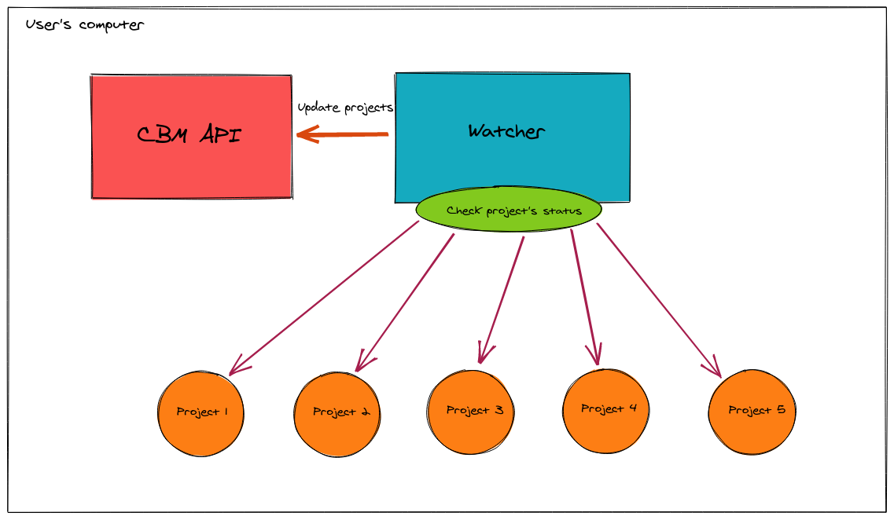
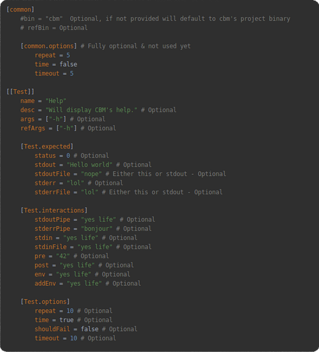
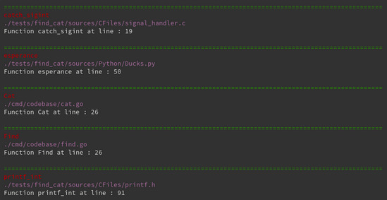
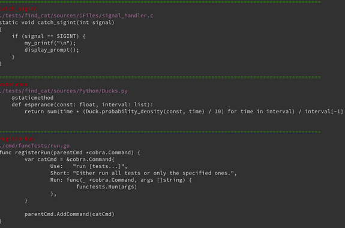
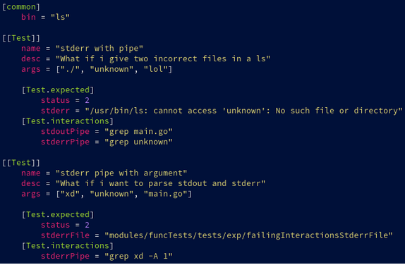
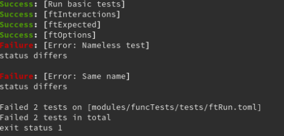

# CodeBaseManager

## Description
CodeBaseManager is a command line tool designed to ease the development of projects through multiple, single purpose, language independent, modules.

Each module are manage differently. By default, there are some modules but you can develop your own if you want. The final objective is to give a true open source tool that can help you to manage your codebase.

It will have a backend to hold information about the codebase, build system and such, of the project for the modules to use.

The project is compose of 3 services : the CLI, a backend and a watcher.

The CLI allow you to launch commands through the terminal who will control the watcher and backend. The watcher is a service who run continuously to get information about projects that wil be send to backend. 

See below a schema of the current architecture 



## Installation

:warning: Requires go 1.14
```
 git clone https://github.com/PoCInnovation/CodeBaseManager
 cd CodeBaseManager
 ./install.sh
```
## Quick Start

```
cbm module [command]
or
cbm help
```

If no command is provided then, depending on the module, you may enter a shell. This shell can execute a command at a time and the module's commands.

## Configuration

Each codebase can be configured thanks to `TOML` file.

For example, it's possible to manage functional tests like this :



## Modules
A module fills up a specific task. In the future they will be able to interact with the backend and with each other (for specific features).

### Current

|        Modules                             | Description | Aliases | Shell |
|:------------------------------------------:|:-----------:|:-------:|:-----:|
|[server](/cli/modules/server/README.md)         | Allows you to interact with CBM's backend | none    | no |
|[repository](/cli/modules/repository/README.md) | Provides helpers for the organization of the repository (as well as project) |none    | no |
|[codebase](/backend/codebase/README.md)     | Allows to find informations about the codebase  |none    | yes |
|[functional-tests](/modules/funcTests/README.md) | Allows to test a binary through the use of [TOML](https://github.com/toml-lang/toml) files to describe tests |"ft" | yes |

### Predicted

| Modules    | Description |
|:----------:|:-----------:|
| unit-tests | Allows to write unit tests for your functions |
| build      | Allows to describe a build system in a unique way |
| debug      | Allows to debug your program or functions |


## Dependencies

|                          Dependency                        |      License       |
|:----------------------------------------------------------:|:------------------:|
| [spf13/Cobra](https://github.com/spf13/cobra)              | Apache License 2.0 |
| [BurntSushi/toml](https://github.com/BurntSushi/toml)      | MIT License        |
| [gin-gonic/gin](https://github.com/gin-gonic/gin)          | MIT License        |
| [logrusorgu/aurora](https://github.com/logrusorgru/aurora) | Unlicense License  |


## Example 

Here is an example of result what you can do with CBM 

### Find module 



### Cat module



### Functional tests

#### Config



#### Result 



------------
## Maintainers

 - [Allan Debeve](https://github.com/Gfaim)
 - [Quentin Veyrenc](https://github.com/VrncQuentin)
 - [Damien Bernard](https://github.com/Encorpluptit)
